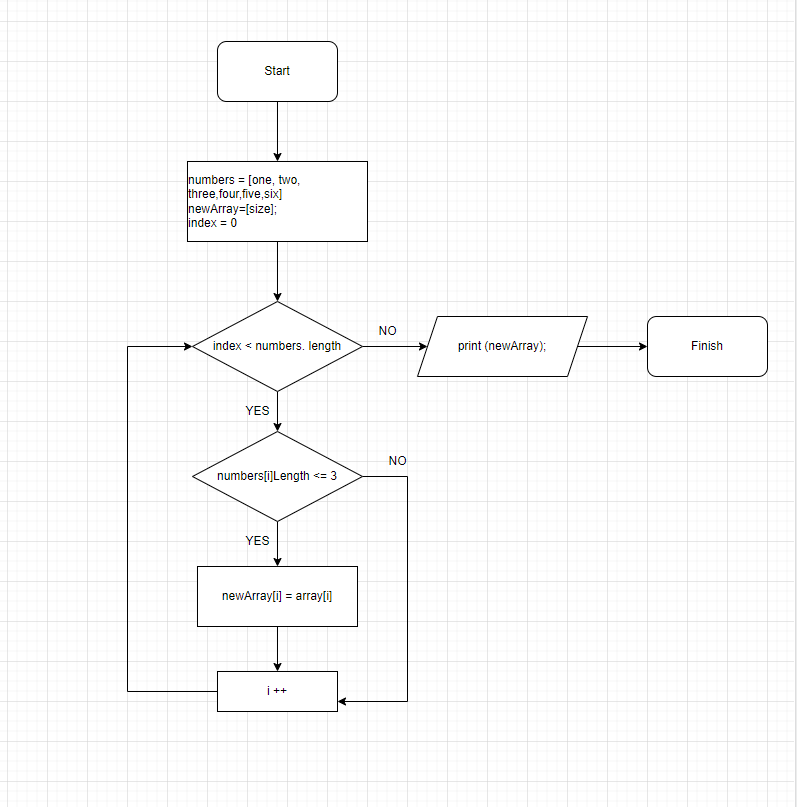

# Алгоритм решения задачи.

1. Вводится массив.
2. С помощью цикла (for), проверяется каждый элемент массива по индексу.
3. Задается условие (if), если длина элемента массива [i] меньше или равна 3 символам ->  в новый массив добавляется текущий элемент.
4. Вывод нового массива 

